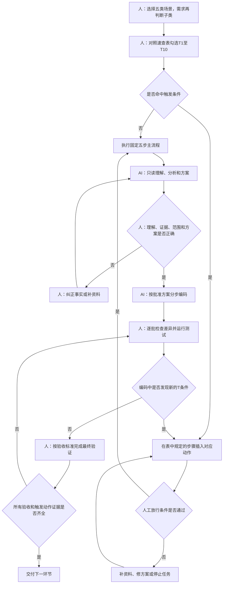
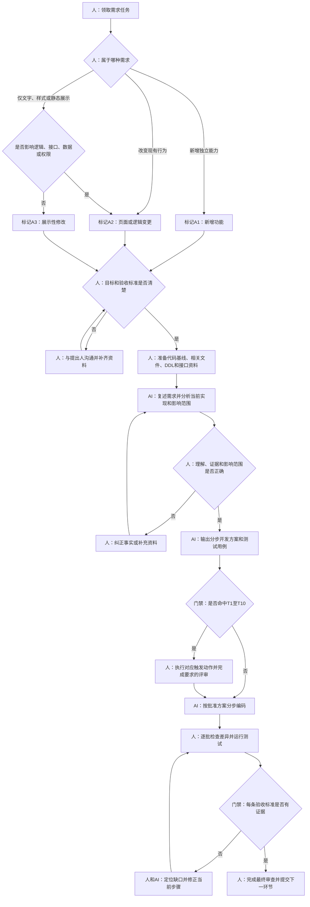
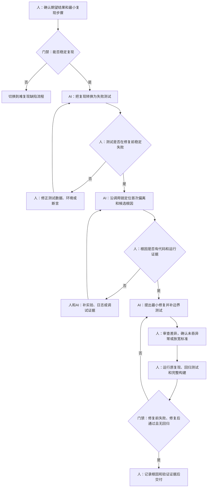
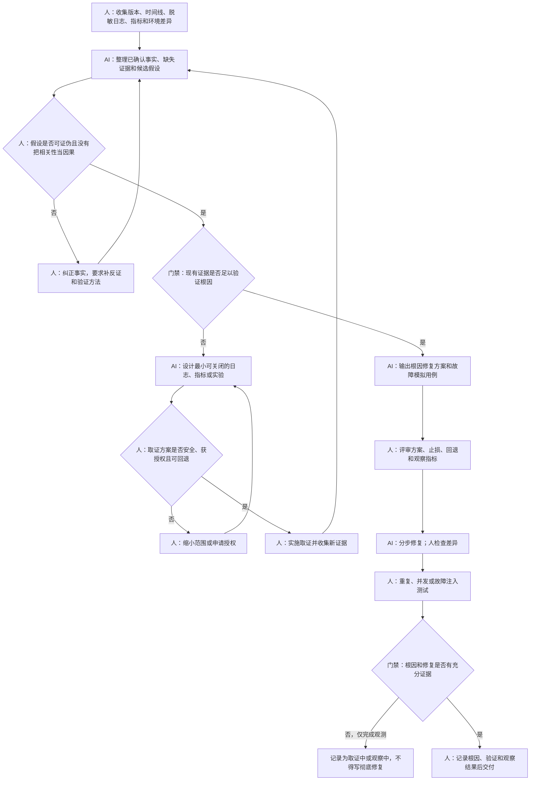
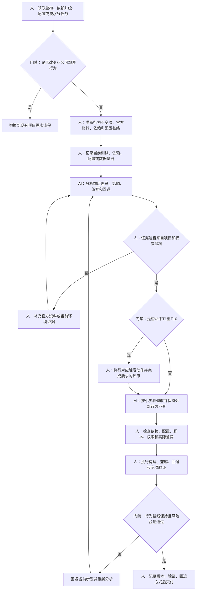
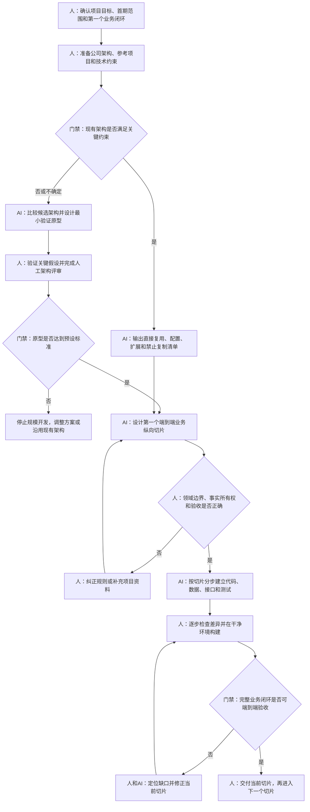

# AI 协作开发标准流程

> 本文档保留为 SOP 系统的设计依据，不再作为开发人员日常执行入口。实际任务请从根目录 `README.md` 调用 `company-ai-development` Skill，由 Skill 自动选路和推进。

## 1. 文档目的

公司开发人员使用 AI 协作开发的经验和能力存在差异。本流程的目标不是要求所有人一步到位掌握最复杂的方法，而是提供一套容易开始、能够重复、可以逐步增强的工作方式，让开发人员先切实感受到任务理解更准确、无效修改更少、自测更充分，再在实际使用中逐渐形成自己的高效方法。

这份文档只规定最低有效流程，不限制开发人员使用更好的工具、提示词和分析方法。无论采用哪种方式，最终都必须由人确认任务理解、检查代码差异、执行测试并对交付结果负责。

适用范围是：开发人员从项目管理工具领取一个任务，完成需求理解、现状分析、开发方案、编码、自测和交付准备。正式测试、上线审批、生产执行不在本流程范围内。

## 2. 先选工作场景

分类只保留五类。判断时只问“这个任务最主要要解决什么问题”，不需要组合多个复杂编号。

| 场景 | 直观判断 | 典型任务 |
| --- | --- | --- |
| A. 现有项目需求 | 要在现有项目中增加或改变功能，再选择 A1/A2/A3 | 新功能、规则变更、页面调整、展示性修改 |
| B. 可复现缺陷 | 按明确步骤能够重复看到错误 | 页面报错、计算错误、状态错误、接口返回错误 |
| C. 难复现缺陷 | 偶发、环境相关或只在生产出现 | 偶发重复、并发问题、生产幽灵缺陷 |
| D. 工程变更 | 主要目的是调整技术资产，业务可观察行为原则上不变 | 重构、依赖升级、运行配置、构建和流水线 |
| E. 新项目 | 需要建立一个新的项目或新架构 | 复用公司架构的新项目、全新架构验证 |

如果一个任务同时具有多种特点，按主要交付结果选择。例如，“新增销售出库功能并建表”属于现有项目需求，并触发 `T3`；“业务规则已经确认，只执行一次历史数据修复”属于工程变更，并触发 `T3`；“ERP 接口增加字段以支持新的计划版本业务规则”属于现有项目需求，并触发 `T3`、`T4`；“仅升级 JDBC 驱动且业务行为保持不变”属于工程变更；“生产偶发库存重复扣减”属于难复现缺陷。

### 2.1 现有项目需求的三种子类

选择场景 A 后，再用下面三个问题确定子类。子类只决定资料和检查重点，不增加新的主流程。

| 子类 | 一句话判断 | 例子 | 默认动作 |
| --- | --- | --- | --- |
| `A1` 新增独立功能 | 是否增加一个此前不存在、可以单独验收的业务能力 | 新增库内移位申请、增加不合格评审功能 | 完整分析业务闭环和影响；通常使用第6节三个检查点 |
| `A2` 修改现有页面或逻辑 | 是否改变现有功能的操作、规则、状态、查询或计算结果 | 修改报工规则、增加查询条件、调整审批逻辑 | 先固定当前行为，再分析新旧差异和回归范围 |
| `A3` 仅修改展示性信息 | 是否只改文字、提示、样式、排序或静态展示，且不改变接口、数据、权限和业务结果 | 修改字段标题、提示语、静态说明和样式 | 可直接使用第5节三轮提示词，重点检查确实没有逻辑影响 |

如果 A3 在分析中发现需要修改后端逻辑、接口字段、数据结构、权限或业务结果，立即改为 A2，并执行相应触发动作。不要为了走短流程把逻辑变更写成展示调整。

场景选定后，立即检查下一节的“条件触发动作表”。不再区分开发人员水平，也不要求先理解入门、标准、增强三套流程。

## 3. 执行方式：固定主流程加条件触发动作

所有任务都执行同一条五步主流程。条件触发动作不是另一套流程，而是在指定步骤中必须增加的动作。没有命中触发条件就不增加；同时命中多项时，把对应动作全部增加。

### 3.1 一页主流程

| 步骤 | 人做什么 | AI 做什么 | 进入下一步的条件 |
| --- | --- | --- | --- |
| 1. 选场景 | 从五类场景中选择一类，判断是否高风险 | 帮助核对选择，不替人决定业务风险 | 场景明确，高风险没有漏标 |
| 2. 准备资料 | 整理任务、验收标准、代码基线和相关文件 | 读取允许访问的资料 | 关键资料齐全，敏感信息已排除 |
| 3. 理解与分析 | 提供资料并限制 AI 先不要改代码 | 复述任务、分析现状、列影响和方案 | 人确认理解、证据和方案正确 |
| 4. 分步编码 | 批准方案，限定每次只做一步 | 先补测试，再小步修改并报告结果 | 人查看差异和测试，当前步骤通过 |
| 5. 完成验证 | 运行完整测试，逐条核对验收标准 | 只读审查最终差异和测试缺口 | 验收标准、代码差异和测试证据一致 |

### 3.2 条件触发动作速查表

执行到表中指定步骤时，发现符合“看到这种情况”，就立即增加对应动作。开发人员无需判断流程等级。

| 编号 | 看到这种情况 | 在哪一步增加 | 必须增加的动作 | 放行条件 |
| --- | --- | --- | --- | --- |
| [`T1`](#t1) | 任务、验收标准或业务规则不清楚，多个来源相互冲突 | 第2步，分析前 | 停止编码；让 AI 整理冲突和最少问题；人向提出人确认 | 关键问题已有明确答案和来源 |
| [`T2`](#t2) | 第一次接触项目、跨模块/服务、影响范围不清、项目文档差 | 第2步，代码分析前 | 构建或刷新 Understand Anything 图谱；记录 Git 提交；AI 输出入口、调用链和影响图 | 人抽查关键路径，图谱与当前提交一致 |
| [`T3`](#t3) | 修改 DDL、历史数据、批量数据或数据库约束 | 第3步方案前、第5步验收时 | 取得最新 DDL；增加预览、影响行数、幂等、备份/回退和独立对账；人工评审 | 试运行、重复执行、回退和对账均有证据 |
| [`T4`](#t4) | 修改 API、消息、文件或第三方接口 | 第3步方案前、第5步验收时 | 制作新旧契约对照；列调用方；增加兼容、超时、重试、幂等、重复/乱序、补偿和契约测试；人工评审 | 新旧调用、异常恢复、切换和回退均通过 |
| [`T5`](#t5) | 修改 MES/WMS/QMS/EAM 核心对象、状态、库存、质量或追溯 | 第3步方案前 | 增加事实所有权、合法状态、撤销/冲销/返工/补偿、权限和追溯检查；人工评审 | 完整业务闭环和异常闭环均有测试 |
| [`T6`](#t6) | 修改登录、权限、租户、敏感信息、密钥或安全组件 | 第2步资料准备、第3步方案前 | 排除敏感信息；增加信任边界、最小权限、越权和泄露测试；安全或项目负责人评审 | 非法访问被阻断，合法访问正常，无敏感信息泄露 |
| [`T7`](#t7) | 性能、并发、锁、事务、缓存、资源或容量相关 | 第2步资料准备、第5步验收时 | 记录当前基线和目标；用相同环境做前后测试；增加并发、长稳、资源和业务正确性对账 | 目标达到且业务结果、数据一致性不退化 |
| [`T8`](#t8) | 偶发、环境相关、只在生产出现或当前无法复现 | 第3步分析时 | 禁止猜测式改码；建立事实、假设、反证和取证循环；必要时先增强可观测性 | 根因有证据，或明确标记为取证中/观察中 |
| [`T9`](#t9) | 生产紧急修复、时间紧且失败影响大 | 第2步开始时、第4步编码前 | 限定最小变更；准备回退、最小测试和上线观察项；取得人工批准；事后补完整审查 | 批准、回退、最小测试和观察指标齐全 |
| [`T10`](#t10) | 全新架构、关键技术选型或现有架构是否可用尚未确定 | 第3步方案前 | 比较真实方案；为最高风险假设做最小原型；设置通过/否决标准；架构评审 | 原型达到预定标准，决策有记录，再开始规模编码 |

### 3.3 触发动作执行规则

1. 在任务资料包中记录命中的 `T` 编号，例如 `场景A，触发T2、T3、T5`。
2. 把相应动作插入表中规定的主流程步骤，不另起一套流程。
3. 多个条件同时命中时逐项执行，不允许用其中一个动作替代另一个。
4. 编码过程中发现新的触发条件时立即停止当前批次，补完对应动作再继续。
5. 第9节完成记录中写明每个触发动作的验证证据。

### 3.4 主流程与触发动作关系图



## 4. 所有流程都要做的准备

### 4.1 检查项目状态

开发人员先确认仓库、分支和本地状态正确，并记录任务开始时的代码基线。检查工作区中是否已有其他任务或他人的未提交修改，不能让 AI 覆盖或清理这些内容。

```powershell
git status --short --branch
git log -1 --oneline
java -version
mvn -version
node --version
npm --version
```

阅读项目中的 `AGENTS.md`、`README.md`、架构说明和测试说明。对现有项目先运行与任务相关的基础测试；如果项目原本就有失败，记录下来，避免后续误判为本次修改引入。

### 4.2 准备最小任务资料包

开发人员至少准备以下信息。可以直接写在提示词里，也可以告诉 AI 文件路径，让 AI 自己读取。

```text
工作场景：A/B/C/D/E；场景A再填写A1/A2/A3
命中的触发动作：T1至T10，没有则写“无”
任务原文：
补充沟通结论：
期望结果：
明确不做的内容：
验收标准：
代码仓库、分支和基线提交：
相关文件：需求、原型、代码、DDL、接口、日志或数据样例
已知限制：版本、兼容、权限、性能或客户约束
AI可以读取的资料范围：
AI禁止接触的信息：密钥、未脱敏生产数据、客户敏感信息等
当前基础测试结果：
```

资料包不要求写成长篇文档，但任务原文、期望结果、验收标准、代码基线和 AI 数据边界不能缺失。没有验收标准时，可以先让 AI 协助整理候选标准，再由开发人员或任务提出人确认。

### 4.3 按任务准备专项资料

| 涉及内容 | 人需要准备 |
| --- | --- |
| 数据库 | 与目标版本一致的最新 DDL、迁移记录、约束、索引和必要的数据分布 |
| API、消息或文件 | 当前契约、字段含义、调用双方、样例、错误码、重试和幂等规则 |
| 生产缺陷 | 生产版本、发生时间、关联标识、脱敏日志/指标、近期发布和环境差异 |
| MOM 业务 | 业务对象、状态、正常与异常流程、事实所有权和追溯关系 |
| 性能 | 当前基线、目标、数据规模、并发模型、测试环境和资源指标 |
| 新项目 | 项目目标、范围、现有架构或参考项目、技术约束和第一个业务闭环 |

缺少的资料如果会改变业务规则、数据所有权、安全或总体方案，应找相关人员补齐，不能让 AI 根据表名、字段名或相似代码猜答案。

### 4.4 判断是否需要 Understand Anything

命中 `T2` 时，先构建或刷新知识图谱：

```text
$understand --language zh
```

只有需要忽略旧图强制重建时才使用 `--full`。范围明确的局部任务可以直接让 AI 搜索入口、调用链、数据库访问和测试，不需要机械地为每个任务构建全量图谱。

## 5. 固定主流程：所有任务直接照着执行

没有命中 `T2` 至 `T8`、`T10` 的普通局部任务，按本节三轮提示词直接执行。命中这些条件时，仍执行同一主流程，但把第一轮替换为第6节的三个独立检查点，并执行第7节对应的触发动作。

### 5.1 第一轮：让 AI 理解任务、分析代码并提出方案

将任务资料包附在下面提示词后：

```text
请协助我完成这个开发任务。现在只允许读取和分析，不要修改文件。

先完成以下工作：
1. 用你的话复述任务目标、范围和验收标准；
2. 读取相关代码和测试，说明当前实现和主要调用链；
3. 列出可能受影响的文件、数据、接口、权限和相关功能；
4. 区分已确认事实、你的推断、需要验证的假设和必须问人的问题；
5. 给出一个尽量小、符合现有架构的修改方案；
6. 给出修改前应补充或执行的测试用例；
7. 对照T1至T10核对是否漏掉触发动作；如果信息不足、存在冲突或新增触发条件，请停止并说明原因。

每个关键结论请给出代码、配置、DDL、接口或测试证据。结尾明确说明是否可以开始编码。

[粘贴任务资料包]
```

开发人员至少检查四件事：AI 对任务的复述是否正确；引用的文件和代码是否真实；影响范围是否遗漏；方案和测试是否能覆盖验收标准。检查不通过时先纠正 AI，不要进入编码。

### 5.2 第二轮：让 AI 按确认方案修改

```text
任务理解和方案已经确认。现在按方案实施，但只做本任务范围内的修改。

要求：
1. 保留工作区已有改动；
2. 先补充或调整能够验证本次行为的测试，再修改实现；
3. 遵循项目现有架构、代码风格和异常处理方式；
4. 不引入未批准依赖，不顺带重构无关代码；
5. 完成后运行相关测试或构建；
6. 输出实际修改文件、修改原因、测试命令和结果；
7. 如果发现范围需要扩大或新命中T1至T10中的任何条件，停止并报告对应编号。
```

AI 修改后，人必须查看实际差异，不能只读修改摘要。确认无关文件没有变化、业务逻辑符合方案、测试不是为了通过而放宽、没有硬编码密钥、调试代码、吞异常和跳过测试。

### 5.3 第三轮：让 AI 审查最终差异

```text
请对本任务的最终git diff做只读审查，不要修改文件。

对照任务目标、验收标准和测试结果，检查：
1. 是否有遗漏需求、错误逻辑、边界或异常路径；
2. 是否影响相关功能、历史数据、接口、权限或兼容；
3. 是否存在无关修改、调试代码、硬编码、吞异常或跳过测试；
4. 每条验收标准是否有测试或可重复验证证据；
5. 每个命中的T1至T10动作是否已有规定的人工检查和完成证据；
6. 哪些内容你无法确认，需要人继续检查。

发现问题时给出文件位置、触发条件和影响。没有发现问题时也要说明检查范围和未检查内容。
```

开发人员处理审查结果后，亲自运行最终测试并填写完成证明。完成标准与开发人员经验无关，统一按第9节检查。

## 6. 第3步拆分模板：命中复杂条件时直接使用

命中 `T2`、`T3`、`T4`、`T5`、`T6`、`T7`、`T8` 或 `T10` 时，不使用第5.1节的合并提示词，必须依次执行本节三个检查点。每个检查点由人确认通过后再进入下一个。

### 6.1 检查点一：任务理解

```text
你现在只做任务理解，不修改任何文件，也不要给出代码方案。

请读取任务资料后输出：
1. 任务目标、使用者、触发条件和期望结果；
2. 范围内和范围外；
3. 可观察的验收标准；
4. 已确认事实、推断、假设和待人决定的问题；
5. 还缺什么资料，以及缺少它会影响什么；
6. 这个任务属于现有项目需求、可复现缺陷、难复现缺陷、工程变更还是新项目；
7. 对照T1至T10逐项判断，输出命中的编号、原因和应插入主流程的动作。

信息不足以继续时明确写“停止”，不要自行补造规则。
```

人确认任务复述、范围和验收标准。任何会改变业务结果的问题没有解决前，不能继续。

### 6.2 检查点二：现状与影响分析

```text
任务理解已经确认。现在只分析现有项目，不修改文件。

请从页面、接口、任务或消息入口开始，追踪到后端业务逻辑、数据库、外部系统和测试。输出：
1. 当前调用链和数据链；
2. 当前行为怎样实现；
3. 可能受影响的代码、表、接口、权限、配置、定时任务和相关功能；
4. 当前测试覆盖和缺口；
5. 每个关键结论对应的文件路径、类/方法、DDL、配置或测试证据；
6. 仍需验证的假设和需要人决定的问题。

涉及MOM业务时，说明业务对象和状态由哪个系统创建、修改和保存，异常后如何撤销、冲销、返工、补偿和追溯。涉及数据库时必须核对最新DDL，不能只根据实体类猜测。
```

人打开关键证据进行抽查，并用代码搜索确认没有漏掉其他入口、消费者、定时任务和共享组件。AI 引用不存在的文件或字段时，立即停止并重新分析。

### 6.3 检查点三：开发方案与测试

```text
根据已确认的任务理解和现状分析，编写开发方案。现在仍然不要修改代码。

方案需要包含：
1. 当前行为、目标行为和差异；
2. 计划修改的模块、数据、接口、配置和测试；
3. 分步实现计划，每一步完成后都能验证；
4. 业务规则、状态、事务、权限和异常处理；
5. 历史数据、在途对象、旧调用方和兼容处理；
6. 回退方式；
7. 测试用例，每条写明前置条件、输入或操作、预期结果和测试层级；
8. 未验证假设、待人决策和编码前阻断项。

优先使用项目已有模式，不引入与任务无关的新框架和重构。
```

人检查方案是否逐条回应验收标准，是否遗漏状态、数据、异常、权限、兼容和回退，测试能否在修改后明确判断对错。方案确认后，使用第5.2节提示词分步编码；每完成一步就检查差异并运行最近层级的测试。最后使用第5.3节提示词审查全部差异。

## 7. 条件触发动作：查到编号后直接照做

<a id="t1"></a>

### 7.1 T1：任务或业务规则不清楚

看到任务只有一句话、验收标准不可观察，或者任务单、代码、用户口述互相冲突时，在第2步停止，不进入代码分析和编码。

1. 人把冲突资料和来源交给 AI。
2. AI 只整理“已经确认、互相冲突、缺失信息、最少需要回答的问题”。
3. 人拿问题向任务提出人或业务负责人确认。
4. 将确认结论补回任务资料包，再重新执行第3步。

追加提示词：

```text
当前任务存在信息冲突。不要选择其中一个答案，也不要分析代码或生成方案。请按“已确认事实、冲突内容、影响、最少确认问题”输出。问题要能由任务提出人直接回答。
```

放行证据是经过确认的验收标准和业务规则来源。没有明确答案不得继续。

<a id="t2"></a>

### 7.2 T2：陌生项目、跨模块或影响范围不清

看到第一次接触项目、变更跨模块/服务、入口和调用链不清或项目文档不足时，在第2步增加知识图谱和影响路径分析。

1. 人记录当前 Git 提交并运行 `$understand --language zh`；图谱过期时先更新。
2. AI 根据图谱和源码输出“入口—调用链—数据写入—外部依赖—测试”的路径。
3. 人至少打开入口、核心业务方法、数据写入和一个关键测试进行抽查。
4. 图谱与源码不一致时以当前源码为准，并让 AI 修正影响清单。

追加提示词：

```text
本任务命中T2。请结合当前提交的知识图谱和源码，输出从入口到业务结果的完整路径、受影响模块和遗漏风险。每个关键结论必须给出源码或配置证据，不能只引用图谱摘要。
```

放行证据是图谱对应的 Git 提交、经过抽查的关键路径和完整影响清单。

<a id="t3"></a>

### 7.3 T3：数据库结构或数据变化

看到新增/修改表字段、约束、索引、历史数据、批量数据或修复脚本时，在第3步方案前增加数据库动作，并在第5步完成专项验收。

1. 人取得目标版本对应的最新 DDL、迁移记录、数据规则和数据规模。
2. AI 输出前置检查、只读预览、正式变更、幂等/断点续跑、锁与性能、备份/回退和独立对账方案。
3. 人核对筛选条件、预计行数、业务正确值来源和是否应通过冲销/补偿而不是直接覆盖历史。
4. 数据库负责人或项目指定人员评审通过后才允许编码或生成正式脚本。
5. 在隔离环境验证零命中、单条、批量、中断、重跑、重复执行、回退和对账。

追加提示词：

```text
本任务命中T3。必须以提供的最新PostgreSQL DDL和迁移版本为准。请输出前置检查、只读预览、预计影响行数、正式方案、幂等或断点续跑、锁与性能、备份/回退、独立对账和应用兼容顺序。禁止连接生产或执行生产写操作。
```

放行证据包括 DDL 版本、评审结论、试运行结果、预计与实际行数、重复执行、回退和独立对账。

<a id="t4"></a>

### 7.4 T4：API、消息、文件或第三方接口变化

看到公共接口字段、错误码、消息 schema、文件格式或第三方契约变化时，在第3步方案前增加契约动作，并在第5步做兼容验收。

1. 人准备当前与目标正式契约、字段含义、调用双方、样例和切换时间。
2. AI 制作新旧契约差异和调用方清单，设计版本兼容、认证、校验、超时、重试、幂等、重复、乱序、部分成功、补偿和对账。
3. 人与接口负责人核对字段语义和事实所有权，字段含义不清时停止。
4. 方案评审后，先建立契约测试和脱敏样例，再修改实现。
5. 验证新旧调用、异常、切换和回退。

追加提示词：

```text
本任务命中T4。请制作新旧契约和字段语义对照，列出所有调用方或消费者，并设计兼容、认证、超时、重试、幂等、重复、乱序、部分成功、补偿、对账、切换和回退。字段语义不清时停止，不要根据名称猜映射。
```

放行证据包括正式契约版本、人工评审、契约测试、新旧调用结果、异常恢复、切换和回退验证。

<a id="t5"></a>

### 7.5 T5：MOM 核心业务对象、状态或事实变化

看到 MES、WMS、QMS、EAM 等系统的核心对象、状态、库存、质量、设备、异常响应或追溯变化时，在第3步方案前增加业务闭环动作。

1. 人准备当前业务流程、对象、状态和相邻系统资料。
2. AI 输出“来源或订单—任务—现场执行—记录—领域结果—接口/事件—查询追溯”链路。
3. AI 说明事实由谁创建、谁能修改、哪个系统权威、谁只引用或做查询投影。
4. 人检查合法状态、撤销、关闭、冲销、返工、补偿、权限、审计和追溯。
5. 项目负责人或领域负责人评审后再编码。

追加提示词：

```text
本任务命中T5。请检查完整MOM业务闭环、业务对象和状态不变量，明确事实创建方、修改方、权威系统、引用方和查询投影。必须覆盖撤销、冲销、返工、补偿、权限、审计和正反向追溯。不要把查询方便当成事实所有权。
```

放行证据是经过评审的事实所有权和状态设计，以及正常、异常、补偿和追溯测试。

<a id="t6"></a>

### 7.6 T6：安全、权限或敏感信息变化

看到认证、授权、数据权限、租户隔离、密钥、个人信息或客户敏感数据时，从第2步开始增加安全动作。

1. 人先移除提示词和样例中的密钥、凭据及未脱敏数据，并确认 AI 可访问范围。
2. AI 输出入口、信任边界、认证、功能权限、数据权限、租户条件和敏感信息流向。
3. 人检查服务端是否实施最小权限，不能用前端隐藏代替授权。
4. 安全或项目负责人评审后再编码。
5. 增加未登录、低权限、跨角色、跨租户、标识篡改、日志/错误信息泄露测试。

追加提示词：

```text
本任务命中T6。只使用已脱敏资料。请分析信任边界、认证、功能权限、数据权限、租户隔离和敏感信息流向，列出可能的绕过入口，并设计未登录、越权、跨租户和信息泄露测试。禁止建议输出或读取真实密钥。
```

放行证据是人工安全评审、非法访问被阻断、合法访问正常和无敏感信息泄露。

<a id="t7"></a>

### 7.7 T7：性能、并发、事务或资源变化

看到响应时间、吞吐、并发、锁、事务、缓存、连接池、线程、内存或容量问题时，在第2步准备基线，并在第5步做前后对比。

1. 人记录当前代码、环境、数据规模、负载、P50/P95/P99、吞吐、错误率和关键资源指标。
2. AI 根据运行证据定位瓶颈，不能只凭代码外观判断。
3. 方案必须说明业务正确性、不变量、资源代价和回退。
4. 每次只实施一个可测量优化，用相同环境和数据复测。
5. 对并发、长稳、超载、超时和业务结果进行测试与对账。

追加提示词：

```text
本任务命中T7。请先根据运行指标和执行证据定位瓶颈，不要立即优化。方案必须给出可比基线、目标、负载模型、资源代价、业务正确性和回退。测试需要覆盖典型、峰值、并发、长稳和超载，并对账优化前后的业务结果。
```

放行证据是相同条件下的前后数据、目标达到、资源可接受且业务结果和数据一致性没有退化。

<a id="t8"></a>

### 7.8 T8：偶发、环境相关或生产幽灵缺陷

看到无法稳定复现、只在特定环境或生产偶发时，在第3步禁止直接进入修复，先增加证据和假设循环。

1. 人准备版本、时间线、环境、脱敏日志/指标、发布记录和相邻成功样本。
2. AI 把信息分为已确认事实、缺失证据、最多三个可证伪假设和最小验证方法。
3. 人检查反证，环境实验每次只改变一个变量。
4. 证据不足时，AI 先设计最小可关闭的日志、指标或关联标识；人检查安全、性能和授权。
5. 根因确认后才进入修复；未确认时任务状态只能写取证中、止损中或观察中。

追加提示词：

```text
本任务命中T8。禁止猜测式修改代码。请输出已确认事实、缺失证据、最多三个可证伪假设、每个假设的支持证据、反证和最小验证方法。证据不足时只设计安全、可关闭的可观测性增强，不要声称已经找到根因。
```

放行证据是根因和修复的因果证据；如果只有观测增强，则用明确的调查状态和后续观察条件交付。

<a id="t9"></a>

### 7.9 T9：生产紧急修复

看到需要紧急止损的生产问题时，从第2步采用压缩但不可省略的动作。

1. 人明确影响、授权人、最小变更范围、回退方式和观察指标。
2. AI 只分析和实施已批准的最小修复，不顺带重构或扩大范围。
3. 编码前由授权人确认压缩版方案、回退和最低测试。
4. 至少执行原问题验证、关键正常路径、构建和可行的回退验证。
5. 交付后补齐最终差异审查、完整回归和根因记录。

追加提示词：

```text
本任务命中T9。只允许设计最小、可快速回退的止损变更。请列出变更边界、最低必要测试、回退步骤、上线观察指标和必须事后补做的检查。未经人工批准不要修改代码或执行外部操作。
```

放行证据是人工批准、最小修复差异、最低测试、回退验证、观察指标和事后补审结果。

<a id="t10"></a>

### 7.10 T10：全新架构或关键技术选型

看到现有架构是否适用尚未确定、需要引入新框架或关键技术路线时，在第3步方案前增加方案比较和原型动作。

1. 人准备业务目标、可量化质量要求、现有架构不足的证据和团队约束。
2. AI 至少比较两个真实方案，不允许先选热门技术再反推需求。
3. 对最高风险假设设计最小原型、通过标准和否决条件。
4. 人运行原型并完成架构评审。
5. 原型达标后，只规划第一个可端到端验收的业务纵向切片。

追加提示词：

```text
本任务命中T10。先不要生成正式项目代码。请根据业务目标和可量化约束比较至少两个真实方案，列出最高风险假设、最小原型、通过阈值和否决条件。原型和架构评审通过后，再设计第一个端到端业务纵向切片。
```

放行证据是方案比较、原型实测、通过/否决结果、架构评审和第一个业务切片方案。

## 8. 五类场景的执行要点与样例

### 8.1 场景 A：现有项目需求

#### 现有项目需求的执行要点

人先判断是 `A1` 新增独立功能、`A2` 修改现有页面或逻辑，还是 `A3` 仅修改展示性信息。A1 重点准备完整业务流程和相邻能力；A2 重点准备变更前后行为、历史数据和明确不变项；A3 重点确认确实不涉及后端、接口、数据、权限和业务结果。AI 必须先查现状再设计，不能根据任务标题直接生成代码。

#### 现有项目需求流程图



#### A类需求快速示例

- `A1`：在现有 WMS 中新增“库内移位申请—任务执行—库存事务—结果查询”能力。这是可独立验收的新功能，通常还会触发 `T2`、`T3`、`T5`。
- `A2`：MES 工单列表增加产线与计划日期组合筛选，改变已有查询行为，需要分析新旧差异和原筛选回归。
- `A3`：把列表标题“计划日期”改为“计划开始日期”，只修改前端文字且不改变字段、查询、接口和权限。若实际还要改变取值或格式，则升级为 A2。

#### 完整样例（A2）：MES 工单列表增加组合筛选

任务单描述为：“MES 工单列表增加产线和计划日期组合筛选，原有工单号、状态筛选保持不变。”

开发人员准备以下资料：任务原文；页面原型；当前工单列表前后端代码路径；工单表最新 DDL；三个现有筛选用例；验收标准，包括单独按产线、单独按日期、组合筛选、清空条件和原筛选回归。

该任务属于 A2。开发人员执行第6节三个检查点。AI 分析后声称“计划日期字段为 `plan_date`”。人打开 DDL 发现实际字段是计划开始时间 `planned_start_time`，而且需要按项目时区取日期范围，于是纠正 AI，要求重新输出影响分析和测试用例。

方案确认后，AI 先补后端查询测试和前端筛选组件测试，再修改查询条件和页面。人检查最终差异，确认没有改变原状态筛选逻辑，并执行：

```powershell
mvn test
npm run test
npm run build
```

完成证明不是“筛选已经做完”，而是五条验收标准均有测试或操作结果，原筛选回归通过，GitHub Actions 通过，并明确数据库没有结构变更。

### 8.2 场景 B：可复现缺陷

#### 可复现缺陷的执行要点

人必须先准备最小复现、期望结果的权威来源和实际结果。AI 应先把复现转成修复前失败的测试，再定位根因。人检查 AI 是否只修表面现象，是否通过吞异常或放宽断言让测试通过。

#### 可复现缺陷流程图



#### 样例：重复扫码导致投料数量重复累计

任务单说明：“同一工单、同一物料条码连续扫描两次，投料数量被重复累计；业务规则要求同一工序不允许重复投料同一码。”

开发人员准备测试工单、物料码、复现步骤、正确业务规则出处、相关接口和数据库表。提示 AI：

```text
这是可稳定复现的缺陷。先复现并建立修复前失败的自动化测试，再定位首次偏离业务规则的位置。不要立即用前端禁用按钮处理，因为服务端仍可能收到重复请求。
```

AI 找到前端重复点击，但人通过接口直接调用验证后发现服务端也缺少幂等校验，于是要求 AI 重新分析。最终方案在服务端根据工序与唯一码建立业务防重，并保留前端重复提交保护。

完成时必须看到：修复前回归测试稳定失败；修复后第一次扫码成功、第二次返回明确业务错误；并发提交不会重复累计；数据库中只有一条有效投料事实；相关正常投料测试通过。

### 8.3 场景 C：难复现缺陷

#### 难复现缺陷的执行要点

人准备版本、时间线、日志、指标、环境差异和相邻成功样本。AI 先建立多个可证伪假设，不允许没有证据直接改代码。人重点检查是否把相关性写成因果、是否遗漏反证，以及新增日志是否泄露敏感信息。

#### 难复现缺陷流程图



#### 样例：生产环境偶发重复报工

生产偶尔出现同一个报工请求生成两条记录，测试环境无法稳定复现。开发人员取得脱敏后的业务关联号、两条记录时间、应用实例、消息标识、发布版本和局部日志，但没有完整调用链。

开发人员使用提示词：

```text
这是生产环境偶发重复报工。禁止直接修改业务代码。请把现有信息分成已确认事实、缺失证据和候选假设。每个假设给出支持证据、反证和最小取证办法，并设计不会输出人员或客户敏感信息的关联日志。
```

AI 提出“用户重复点击、网关重试、消息重复消费”三个假设。人检查后发现该入口不是消息消费，删除第三个假设；同时发现现有日志没有请求幂等键，于是先做经过评审的关联日志和指标增强，而不是直接加数据库唯一约束。

后续证据确认网关超时重试且服务端没有幂等保护，再进入修复。完成证明包括证据时间线、根因、可重复的重试模拟、幂等测试、重复请求的数据对账和观察指标。若当前只完成观测增强，任务状态必须写“取证中”，不能写“已彻底修复”。

### 8.4 场景 D：工程变更

#### 工程变更的执行要点

工程变更的判断标准是：主要交付物是技术资产变化，业务可观察行为原则上不变。人根据任务类型准备行为不变项、官方版本资料、依赖树、配置来源或流水线基线。AI 必须说明前后差异、兼容和回退。如果实施目的或结果会改变业务规则、页面行为、接口语义或业务数据，应重新归类为场景 A，并叠加相应 `T` 动作。

#### 工程变更流程图



#### 样例：升级 PostgreSQL JDBC 驱动并保持业务行为不变

项目需要把 PostgreSQL JDBC 驱动从当前版本升级到公司批准的目标版本，以修复依赖安全问题。任务明确要求 SQL、接口、事务语义、日期时间和业务结果保持不变。这属于工程变更，并因安全依赖升级触发 `T6`；如果测试发现性能变化，再增加 `T7`。

开发人员准备当前和目标依赖版本、`pom.xml`、完整依赖树、目标版本官方发布说明、Java 17/Spring Boot 3/PostgreSQL 兼容信息、连接池配置、现有数据库集成测试和回退版本。提示 AI：

```text
这是依赖升级类工程变更，业务可观察行为必须保持不变。请根据项目依赖树和目标版本官方资料分析直接依赖、传递依赖、驱动默认行为、连接、事务、批处理、日期时间、类型映射、性能和回退风险。先输出需要建立的行为基线和测试，不要修改业务SQL或顺带升级其他依赖。
```

AI 初版建议同时调整部分日期字段映射以采用新驱动默认行为。人检查后发现这会改变接口返回时间语义，不符合“业务行为不变”，于是要求保留项目现有显式时区和类型转换配置，并把日期时间回归加入测试。

完成证明包括升级前后依赖树、官方兼容依据、数据库连接、查询、事务提交/回滚、批处理、日期时间、主要业务回归、依赖安全扫描、性能冒烟和回退验证。任何业务结果变化都应停止本工程任务，另建场景 A 的需求或缺陷任务处理。

### 8.5 场景 E：新项目

#### 新项目的执行要点

人先准备项目目标、范围、用户、第一条业务闭环、公司架构基线和部署约束。AI 应区分通用架构、项目配置和客户特有规则。新架构项目先比较方案并做最小原型，不能直接生成大量项目代码。

#### 新项目流程图



#### 样例：基于公司架构建设新客户 QMS 项目

项目首期目标是完成“来料检验任务生成—检验记录—判定—不合格评审—结果回传”的闭环，复用公司 Java 17、Spring Boot 3、Vue 3 和 PostgreSQL 架构。

开发人员准备公司项目骨架、参考 QMS 项目、首期范围、角色、相邻 ERP/WMS 接口和部署约束，并提示 AI：

```text
这是基于公司现有架构的新项目。请分析参考项目并输出“可以直接复用、需要配置、需要扩展、禁止复制”的清单。禁止复制参考客户的组织、物料、检验规则、接口地址和密钥。先设计一个能够端到端验收的来料检验纵向切片，不要先生成全部模块空壳。
```

AI 分析参考项目后把“检验完成自动放行库存”当成通用能力。人依据系统边界纠正：QMS 负责判定，WMS 是否执行库存放行需要当前项目接口规则确认。AI 随后把它改为待决策接口，并补充失败补偿和对账。

完成第一个纵向切片时，应能从 ERP/WMS 来源生成检验任务，记录结果并完成判定，异常时留下可恢复状态，结果可以回传并追溯。干净环境构建、数据库初始化、权限、接口模拟和核心测试均通过，才算该切片完成。

## 9. 如何证明任务真正完成

每个任务最终只需要保留一段简洁的完成记录，不保存全部 AI 对话：

```text
工作场景、需求子类与命中的触发动作：
任务目标和验收标准：
实际完成内容：
明确未包含内容：
主要修改范围：
执行的测试命令：
验收标准与测试结果对应关系：
GitHub Actions结果：
数据库、接口、权限、兼容和回退说明：
未执行测试、已知限制和剩余风险：
结论：具备/不具备提交测试或评审的条件
```

开发人员在提交前逐项确认：

- [ ] AI 对任务的理解已经由人确认。
- [ ] 关键现状结论有真实代码、DDL、接口、日志或测试证据。
- [ ] 最终实现没有超出任务范围。
- [ ] 人已经逐文件检查最终差异，没有无关修改和原有内容被覆盖。
- [ ] 每条验收标准都有测试或可重复的人工验证结果。
- [ ] 相关 Maven、JUnit 5/Mockito、Vitest 和构建检查已经执行。
- [ ] 每个命中的 `T1` 至 `T10` 触发动作都已完成，并保留规定的人工评审和验证证据。
- [ ] GitHub Actions 已通过，或者明确记录未执行原因与影响。
- [ ] 没有密钥、未脱敏生产数据、调试代码、吞异常和跳过测试。
- [ ] 已说明兼容、回退、限制和剩余风险。

任意一项无法确认时，任务不能标记为开发完成。“AI 已经写完”“本地看起来正常”和“AI 已经审查”都不能单独作为完成证据。

## 10. 在不改变主流程的前提下改进

本流程可以直接执行，不要求开发人员先学习一套方法论。实际使用中可以调整提示词、增加自动化工具、建立项目专用检查表，或把重复分析沉淀为仓库说明和测试，但仍保留“五步主流程”和“条件触发动作”。改进应满足三个条件：比原流程更省时间；没有降低人工责任和验证标准；其他开发人员能够理解和复用。

每完成几个任务，可以回顾一次：哪一条提示词真正减少了返工；哪些资料总是缺失；哪些检查可以自动化；哪些 AI 建议经常不可靠。只沉淀已经在真实任务中验证有效的做法，不为了显得先进增加无实际收益的步骤。

## 11. 必须停止 AI 编码的情况

出现以下情况时，应停止让 AI 继续修改：

- AI 对任务目标或验收标准理解错误，纠正后仍不稳定。
- 任务描述、代码、数据库或接口互相冲突，无法确定权威事实。
- AI 引用不存在的文件、字段、接口或测试。
- 缺少最新 DDL、正式接口契约、生产证据或关键业务规则。
- 实施范围扩大到未评审的数据库、接口、安全、MOM 核心状态或跨系统变化。
- 测试只能通过删除用例、放宽正确断言、吞异常或跳过构建来通过。
- 需要未经授权的生产访问、数据写入、密钥读取或外部系统操作。
- 开发人员无法解释 AI 生成代码为什么正确。

停止时记录已经确认的事实、当前阻断、需要谁提供什么资料以及恢复条件。正确停止比在错误上下文中继续生成代码更能提高整体效率。
