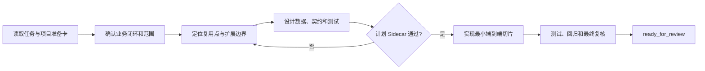

# A1：现有系统新增独立功能

## 什么时候使用

任务在现有系统中增加此前不存在、可以独立验收的业务能力。若只是改变已有页面、规则或状态，改用 A2。

## 自动准备

AI 读取任务、原型、相邻功能、项目架构、代码入口、测试、DDL和契约，整理第一条完整业务闭环。人只补充无法从资料确认的角色、业务规则、范围和验收结果。

## 执行步骤

1. 复述使用者、触发条件、目标结果、范围外和可观察验收标准。
2. 从入口追踪到业务逻辑、数据写入、外部系统、查询和追溯，列出可复用、需扩展和禁止复制的内容。
3. 设计一个最小但完整的纵向切片，覆盖正常、异常、撤销或补偿，而不是先生成全部模块空壳。
4. 将每条验收标准映射到测试；自动化薄弱时先建立特征测试或可重复验证脚本。
5. Sidecar 复核业务闭环、范围、事实所有权和测试方案后，按切片小步实施。
6. 完成后执行项目测试、构建、最终差异审查和 Sidecar 终审。

## 人只需确认

- 新能力解决的业务问题和首期范围；
- 关键业务对象、状态和相邻系统责任；
- AI 无法从权威资料确认的业务规则；
- 最终纵向切片是否可以独立验收。

## 完成证据

首个业务闭环可以从来源走到业务结果并反向追溯；异常后存在明确状态和恢复方式；权限、数据、接口及相关回归均有证据；没有复制参考客户的规则、地址、账号或数据。

## 可直接套用的样例

任务输入：“在 WMS 增加库内移位申请、任务执行和结果查询能力。”AI 应先从现有任务和库存事务中确认复用点，列出申请、执行、库存变化、异常补偿和查询追溯闭环，再生成计划检查包。人只确认移位状态、库存事实所有权和首期异常范围。计划通过后，AI 按一个可演示的端到端切片实施，并用自动化测试、库存对账、相邻功能回归和最终 Sidecar 报告证明完成；只建立页面和表不得结束任务。
