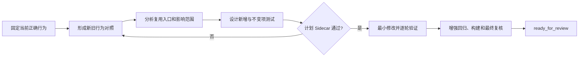

# A2：修改现有页面或业务逻辑

## 什么时候使用

任务改变已有功能的操作、查询、计算、规则、流程、状态或业务结果。只改文字和样式且没有任何逻辑影响时使用 A3。

## 自动准备

AI 找到当前入口、调用链、数据链、相关测试和历史行为，整理“当前行为—目标行为—明确不变项”。人只确认业务差异和验收口径。

## 执行步骤

1. 固定当前正确行为，优先运行现有测试；没有测试时补特征测试或可重复验证脚本。
2. 输出新旧行为对照，明确修改范围、回归范围和不变项。
3. 检查同一方法、组件、表、接口或状态是否被其他入口复用。
4. 为新增行为、原有行为、边界、异常和权限设计测试。
5. Sidecar 复核影响范围和测试方案后，先测试再按最小步骤修改。
6. 每批检查实际差异；最终执行相关测试、构建、回归和 Sidecar 终审。

## 人只需确认

- 新旧业务行为差异是否准确；
- 哪些现有行为必须保持不变；
- 关键规则和验收标准；
- 最终差异是否符合业务意图。

## 完成证据

每条新验收标准有证据，原有不变项和相关功能回归通过，修改范围没有扩大，历史数据、旧调用方和在途对象得到正确处理。

## 可直接套用的样例

任务输入：“MES 工单列表增加产线和计划日期组合筛选，原有筛选保持不变。”AI 应先运行或补充现有筛选的特征测试，从 DDL、接口和代码确认字段、空值与时区口径，输出单条件、组合条件、非法日期、分页和原筛选回归矩阵。人只确认计划日期的业务时区和空产线含义。计划通过后，AI 修改查询与页面，执行 JUnit、Vitest、构建和关键交互验证，并用新筛选生效、旧筛选不变和查询性能证据结束任务。
