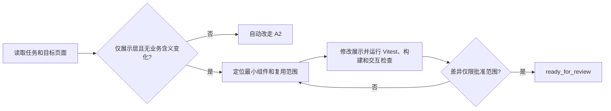

# A3：仅修改展示性信息

## 什么时候使用

只修改文字、提示、样式、排序或静态展示，并且不改变后端、接口、数据、权限、计算和业务含义。

## 快速流程

1. AI 搜索文字、组件、样式和相关测试的所有引用位置，先不修改。
2. AI 明确回答是否涉及接口字段、数据取值、格式规则、权限或业务语义。
3. 发现任何逻辑影响时自动改走 A2。
4. 没有逻辑影响时实施最小修改，不顺带重构组件。
5. 人检查文件列表和视觉含义，AI 运行相关 Vitest 和前端构建；有条件时检查关键页面。
6. Sidecar 可以使用独立只读代理或人工快速复核，不要求复杂方案评审。

## 人只需确认

- 新文字或展示效果是否表达正确；
- 变更确实没有改变业务含义；
- 页面最终效果符合任务要求。

## 完成证据

只有预期展示文件发生变化；相关测试和构建通过；不存在后端、契约、数据、权限或业务结果变化。

## 可直接套用的样例

任务输入：“把工单列表中的‘计划日期’改成‘计划开始日期’，并调整列宽。”AI 应先搜索文案和组件复用位置，确认字段、接口、导出、权限和业务术语均不变；如果导出标题也必须变化或文案代表新业务含义，则自动升级为 A2。保持 A3 时，人只确认目标页面和最终视觉效果。AI 修改最小组件，运行相关 Vitest、前端构建和关键交互检查，用截图或人工视觉确认及差异清单结束任务。
