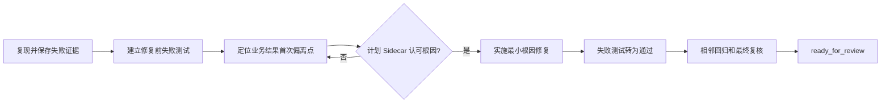

# B：可稳定复现缺陷

## 什么时候使用

按照明确的环境、数据和步骤可以重复观察到错误，并且正确结果有权威依据。无法稳定复现时使用 C。

## 自动准备

AI 整理最小复现、期望结果来源、实际结果、版本、测试数据和相关调用链。人只确认“什么才是正确结果”。

## 执行步骤

1. 在修改前重现问题并保存结果。
2. 优先把复现转换为自动化失败测试；条件不足时建立可重复接口、SQL或页面验证脚本。
3. 沿调用链寻找业务结果第一次偏离的位置，用代码和运行证据确认根因。
4. Sidecar 检查根因是否只是相关性、方案是否只修表面现象。
5. 实施最小修复并补充边界、异常、并发或权限测试。
6. 证明同一个测试修复前失败、修复后通过，再执行相关回归和最终审查。

## 人只需确认

- 正确业务结果和依据；
- 复现步骤与真实问题一致；
- 根因和修复是否符合业务规则；
- 最终结果是否解决原问题而未引入副作用。

## 完成证据

保存修复前失败、根因证据、修复后通过、边界测试和相关回归结果。删除用例、放宽断言、吞异常或仅在前端隐藏问题均不算修复。

## 可直接套用的样例

任务输入：“同一工序连续扫描同一物料码，投料数量重复累计，每次都能复现。”AI 应保存请求、投料事实和库存结果，先写出修复前失败的重复扫描测试，再沿接口、幂等键、投料事务和数据库约束定位第一个错误点。人只确认重复扫描应返回原结果还是明确报错。Sidecar 认可根因后，AI 做最小修复，证明失败测试转为通过、首次扫描仍正确、并发重复请求和其他投料路径未被破坏。
