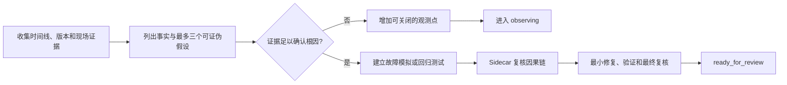

# C：难复现或生产偶发缺陷

## 什么时候使用

问题偶发、依赖特定环境或数据组合、只在生产出现，当前无法稳定复现。不要在缺少因果证据时直接改业务代码。

## 自动准备

AI 整理版本、时间线、关联标识、脱敏日志、指标、配置、近期发布、失败样本和相邻成功样本。人协助取得经过授权的现场证据。

## 执行步骤

1. 把信息分为已确认事实、缺失证据和最多三个可证伪假设。
2. 为每个假设列出支持证据、反证和最小验证方法；环境实验每次只改变一个变量。
3. 证据不足时只设计安全、低开销、可关闭的日志、指标或关联标识。
4. Sidecar 检查是否把相关性当成因果、是否遗漏反证、取证是否泄露敏感信息。
5. 根因确认后再进入修复，使用重试、并发、故障注入或环境模拟建立回归。
6. 无法完成生产观察时，以 `observing` 结束当前开发阶段，明确部署、观察窗口、指标和恢复条件。

## 人只需确认

- 现场事实和证据是否真实；
- 取证或生产观察是否获得授权；
- 根因是否有足够因果证据；
- 当前任务应进入修复还是继续观察。

## 完成证据

允许三种结果：取证增强完成并进入 `observing`；根因确认进入 `diagnosed`；根因修复及故障模拟通过进入 `ready_for_review`。仅增加日志不能称为已修复。

## 可直接套用的样例

任务输入：“生产偶发重复报工，开发和测试无法复现，每周约两次。”AI 不得直接增加幂等代码，而应整理发生时间、版本、请求标识、实例、超时、网关重试、消息消费和相邻成功样本，形成不超过三个假设及各自反证方法。人只负责授权脱敏日志和生产观察窗口。证据不足时，AI 交付可关闭、低开销的关联日志并以 `observing` 结束；只有证据证明重复请求或重复消费后，才建立故障模拟、修复并以回归证据进入 `ready_for_review`。
