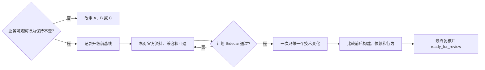

# D：工程变更

## 什么时候使用

主要交付物是重构、依赖升级、配置、构建、流水线或技术迁移，并且业务可观察行为原则上保持不变。一旦业务规则、页面行为、接口语义或业务数据结果发生变化，重新选择 A、B 或 C。

## 自动准备

AI 根据任务类型取得行为不变项、当前依赖树、官方版本资料、配置来源、流水线基线、现有测试和回退版本。人确认哪些业务行为必须不变。

## 执行步骤

1. 建立升级或重构前的构建、测试、依赖、配置、性能和关键业务行为基线。
2. 根据项目和官方资料分析直接与传递依赖、默认行为、兼容、迁移和回退。
3. Sidecar 检查任务是否伪装成工程变更却实际改变业务行为，以及是否存在无关升级。
4. 每次只做一个可验证的技术变化，不顺带升级或重构。
5. 比较前后依赖、配置、构建产物、测试和关键业务结果。
6. 运行兼容、回退和最终差异检查后进入 Sidecar 终审。

## 人只需确认

- 业务可观察行为不变项；
- 官方资料和目标版本是否符合公司要求；
- 兼容和回退风险是否可接受；
- 最终没有暗含业务变化。

## 完成证据

前后行为基线一致，构建和测试通过，依赖或配置差异符合批准范围，兼容和回退经过验证。任何业务结果变化都要停止并重新分类。

## 可直接套用的样例

任务输入：“把 PostgreSQL JDBC 驱动升级到公司批准版本以修复漏洞，业务行为不变。”AI 应先记录当前依赖树、构建、连接、事务、批处理、时间类型和关键查询基线，再核对官方发布说明、传递依赖和回退版本。人只确认批准版本和不可变化的业务行为。Sidecar 通过后，AI 只升级该依赖，重复执行基线与安全检查；不得顺便改 SQL、日期语义或其他依赖，任何业务结果变化都必须停止并重新分类。
