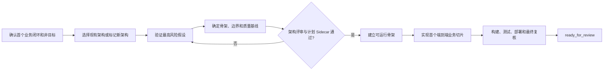

# E：新项目首个业务切片

## 什么时候使用

需要建立新项目骨架或首个可以端到端验收的业务切片。本 SOP 不替代立项、产品设计和公司架构决策。

## 自动准备

AI 读取项目目标、首期范围、公司架构基线、参考项目、部署约束、相邻系统和第一条业务闭环。人确认项目范围、客户特有规则和关键架构取舍。

## 执行步骤

1. 将参考项目内容分成可以复用、需要配置、需要扩展和禁止复制。
2. 验证现有架构是否满足可量化约束；不满足或不确定时，比较方案并做最小原型。
3. 经过架构评审后，设计第一个端到端业务纵向切片，不先生成全部模块空壳。
4. Sidecar 检查领域边界、事实所有权、客户数据污染、异常恢复和验收闭环。
5. 按切片建立代码、数据库、接口、权限和测试，在干净环境持续构建。
6. 第一个切片达到验收后结束当前任务，再开始下一个切片。

## 人只需确认

- 项目目标、首期范围和第一个业务闭环；
- 公司架构是否复用或需要正式评审新架构；
- 客户特有规则和相邻系统责任；
- 当前切片是否具备独立业务价值。

## 完成证据

项目能在干净环境初始化和构建；首个闭环从来源走到结果并能追溯；异常留下可恢复状态；权限、接口模拟和核心测试通过；未复制参考客户的组织、规则、地址、账号或数据。

## 可直接套用的样例

任务输入：“基于公司架构建设新客户 QMS，首个版本完成来料检验闭环。”AI 应确认检验任务、记录、判定、不合格评审、结果回传、权限和追溯边界，区分可复用基线、客户配置和禁止复制的数据。若现有架构不满足约束，自动增加架构评审和最小原型。人只确认业务范围、事实所有权与架构例外。通过评审后，AI 建立可构建、可测试、可部署的骨架并实现首个闭环；一次生成所有菜单和空模块不得作为完成结果。
