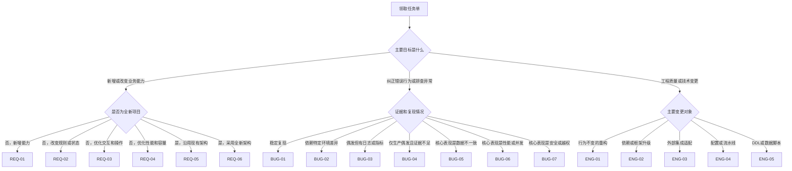

# 场景分类与选路

## 1. 分类原则

每个任务选择一个主场景，用来决定主要工作方法；同时叠加零个或多个风险标签，用来追加数据库、接口、安全、性能、兼容和业务闭环检查。主场景回答“这项工作的主要不确定性是什么”，风险标签回答“这项变更可能伤害什么”。

主场景不可多选。一个任务如果既包含功能新增又包含数据迁移，应以交付目标为准：交付目标是新业务能力时选择 `REQ-01` 并叠加 `DATA`；交付目标只是执行一次历史数据修复时选择 `ENG-05`。任务包含两个相互独立的主要目标时，应拆分任务单。

## 2. 选路决策树

## 3. 容易混淆的场景

| 判断问题 | 选择规则 |
| --- | --- |
| 新功能还是现有功能变更 | 是否新增一个可独立验收的业务能力；只是改变已有能力的规则、流程或状态时选择 `REQ-02` |
| 优化还是缺陷 | 当前行为符合已确认规则但需要更好时是优化；违反规则、验收标准或历史正确行为时是缺陷 |
| 性能需求还是性能缺陷 | 新增明确容量或响应目标选择 `REQ-04`；相对既定基线或承诺发生退化选择 `BUG-06` |
| 数据缺陷还是数据脚本 | 先排查造成异常数据的根因选择 `BUG-05`；已确认规则和范围，只需实施迁移或修复时选择 `ENG-05` |
| 环境特定还是幽灵缺陷 | 已识别能决定复现结果的环境差异选择 `BUG-02`；差异未知且主要依赖生产现场证据选择 `BUG-04` |
| 重构还是功能优化 | 对外行为、接口、状态和数据语义完全不变选择 `ENG-01`；任何可观察行为变化选择对应需求场景 |
| 接口适配还是业务变更 | 主要目标是适配外部契约选择 `ENG-03`；主要目标是新增业务能力，则选择需求场景并叠加 `CONTRACT` |

## 4. 风险标签

| 标签 | 触发条件 | 必须增加的检查 |
| --- | --- | --- |
| `DATA` | DDL、迁移、批量更新、历史数据、不可逆数据影响 | 最新 DDL、影响行数、试运行、幂等、备份/回退、执行后对账 |
| `CONTRACT` | 公共 API、消息、文件、错误码、对外查询口径变化 | 调用方清单、契约兼容、版本策略、超时重试、幂等和异常补偿 |
| `MOM-DOMAIN` | 改变生产、库存、质量、设备、异常、协同或追溯事实 | 对象、状态、不变量、事实所有权、撤销/冲销/返工/补偿和追溯检查 |
| `SECURITY` | 认证、授权、租户、隐私、密钥、敏感数据 | 威胁分析、最小权限、越权用例、日志脱敏、依赖与静态安全检查 |
| `PERFORMANCE` | 并发、锁、事务、缓存、容量或性能目标 | 可比基线、代表性数据、负载模型、资源指标、执行计划和回归阈值 |
| `COMPATIBILITY` | 历史数据、旧客户端、多版本或灰度并存 | 兼容矩阵、双向验证、默认值、升级/降级和回退路径 |
| `CROSS-MODULE` | 跨模块、跨服务、跨系统或多个事实域 | 影响链、数据所有权、调用顺序、一致性、监控和联合验证 |
| `HOTFIX` | 生产紧急修复 | 最小复现或证据、限界变更、回退方案、上线后观察项和事后补审 |

## 5. 风险等级判定

### L1：轻量流程

同时满足以下条件时为 `L1`：变更局部且可逆；不改变公共契约、DDL、权限、关键业务状态或跨模块关系；现有自动化测试能够覆盖主要回归。开发人员可以完成方案自审，但仍须执行最终差异检查和适用测试。

### L2：标准流程

模块级业务变化、影响多个代码区域、新增可独立验收能力、测试基础薄弱或回归面较大时为 `L2`。必须形成开发方案、自测报告和明确的影响范围；是否人工评审由项目规则决定。

### L3：增强流程

命中 `DATA`、`CONTRACT`、`SECURITY`、关键 `MOM-DOMAIN`、跨服务、高并发、难回滚或 `HOTFIX` 时默认为 `L3`。主体编码前必须完成人工开发方案评审；若为紧急热修，可先完成压缩版方案和授权，但不得取消回退、验证及事后补审。

当多个条件冲突时取最高等级。任务范围在实施过程中扩大时，必须重新分级，而不是沿用开始时的低等级。

## 6. 开始条件

任何场景开始编码前都应具备以下最小信息：

- 可追溯的任务单、提出人或业务确认人。
- 任务目标、范围外内容和可观察的验收标准。
- 目标仓库、基线提交、目标分支、适用环境和版本。
- 项目级 AI 数据使用约定；没有约定时采用最小安全默认值。
- 当前能够取得的代码、文档、DDL、接口、配置、日志、数据样例和历史任务证据清单。
- 主场景、风险标签和风险等级。

缺少的信息如果会改变业务含义、系统边界、数据安全或总体方案，应停止并向提出人或负责人确认。只影响实现细节且可以安全验证时，可以把它记录为假设并设计验证步骤。
