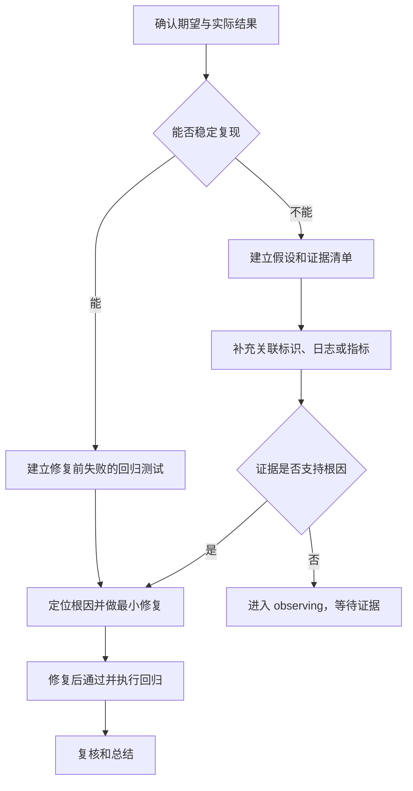

# 缺陷处理

## 适用条件

当前行为与已经确认的正确结果不一致，或者存在需要排查的异常。先判断能否稳定复现，不必让开发人员选择更多缺陷分类。

## 稳定复现

1. 记录最小复现步骤、数据、环境、期望和实际结果。
2. 优先建立修复前失败、修复后通过的自动化测试。
3. 区分根因、触发条件和表面症状，只修改有证据支持的根因。
4. 回归相邻正常路径和历史边界。
5. 修复方案展示后请开发人员回复 `确认方案`，再编码；实施代理不得自行勾选已批准。最终仍须回复 `确认结果`。

## 难复现或生产偶发

1. 禁止根据单一猜测直接修改业务逻辑。
2. 建立假设、支持证据、反证和采集方式。
3. 优先补充关联标识、关键状态、版本、配置、日志和指标。
4. 证据不足时以 `observing` 结束，明确观察窗口和下一步，不得声称已经修复。

## 示例

任务：生产环境偶发重复报工，测试环境无法复现。

AI 应先检查幂等键、事务边界、重试和并发证据，设计能够关联同一请求的日志与指标。仅发现一处“看起来可能重复调用”的代码不足以直接修复。
