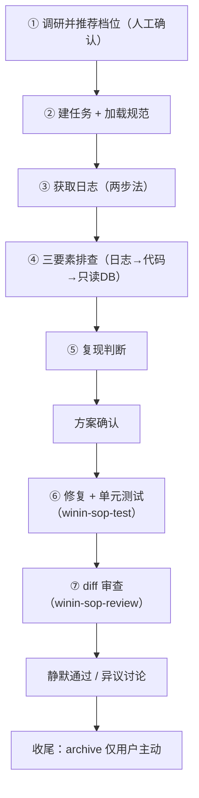

# 缺陷处理（入口）

## 触发即获工作流

本 skill 是缺陷任务的唯一入口。用户触发本 skill 后，按以下流程执行；任务协议、状态机、门禁、纪律等共享规则见共享契约 `../winin-sop-common/workflow.md`。

## 流程总览



## ① 调研并推荐档位（人工确认）

- 快速只读调研：异常堆栈定位模块（如有）→ 涉及文件 → 客观硬性信号扫描（数据库/接口/异步调用/跨服务）→ 规模估计。命中硬性信号立即停止调研。
- 展示调研摘要 + 推荐档位 + 理由，请开发人员确认或调整。
- 命中硬性信号 → 自动置 `independentReview: true`，并在调研摘要里用自然语言带过（如"涉及数据库变更，交付前会加一道独立把关"），不要求用户理解或选择"独立复核"机制。
- 用户表达更谨慎的意愿（"仔细一点""稳妥些""不放心"）→ 置 `independentReview: true`。
- 确认结果在 ② 建任务时登记进 task-state.json（见 ../winin-sop-common/workflow.md task-state.json 段；L1 不建任务）。
- 缺陷"是否难复现"在调研阶段无法判定，不作为定档依据。用户报告"偶发/线上"时，调研阶段按客观信号定档，排查中尝试复现失败再置 `independentReview: true`（见⑤）。

档位决定产物：L1 直接修；L2 = task-state.json + prd.md + design.md。命中硬性信号/难复现 → 置 independentReview: true，交付前加独立复核。

## ② 建任务 + 登记档位 + 加载规范

- 若工作区尚无 `.ai-sop/`（如刚迁移本 skill 包）：先运行 `node ../winin-sop-common/scripts/winin-sop.mjs init-env --repo <工作区根>` 创建环境骨架（spec/tasks/archive + 索引模板），再建任务。
- L2：`node ../winin-sop-common/scripts/winin-sop.mjs init --repo <root> --task <编号> --title <标题>`
- 登记档位：编辑 task-state.json 的 complexity 字段（level/reason/confirmedBy/confirmedAt；字段模板见 ../winin-sop-common/workflow.md）
- 加载规范：调用 `../winin-sop-spec/SKILL.md`（项目约定、业务领域规范，按风险点命中加载；日志路径/DB 连接等运行时信息从配置文件读取，不在规范库查找）。

## ③ 获取日志（必做）

### 3.1 定位日志路径（按顺序尝试，不假设任何一处必有）

1. 配置推断（MOM 惯例，其他项目按相同思路从配置推断）：
   - 从异常堆栈顶部包名确定模块：`com.win.module.{name}.xxx` → 模块目录 `win-module-{name}`
   - 读模块 `bootstrap.yaml`：`spring.application.name`（如 `wms-server`）与 `logging.file.name`（通常 `logs/${spring.application.name}.log`）
   - 日志文件 = 模块目录下 `logs/{app-name}.log`
2. 搜索：
   ```powershell
   Get-ChildItem -Path <模块目录> -Filter "*.log" -Recurse | Where-Object { $_.Length -gt 0 } | Select-Object FullName, Length
   ```
   按修改时间取最新；注意日志按大小/时间滚动（单文件最大 100MB，保留 30 天），旧日志在 `.log.{日期}.gz` 归档中。
3. 仍找不到：直接问用户日志位置。

每一步先检查"是否存在/有内容"，再决定是否使用；spec 可能不存在或未填写，不能假设其内容。

### 3.2 读取与分析日志

```powershell
# 读最新错误（尾部 200 行）
Get-Content -Path logs/{app-name}.log -Tail 200
# 按关键词搜索
Select-String -Path logs/{app-name}.log -Pattern "ERROR|Exception|Caused by|ConstraintViolation"
# 读特定时间段
Select-String -Path logs/{app-name}.log -Pattern "2026-07-24 14:" | Select-Object -First 50
```

分析要点：异常类名、错误行号（XxxService.java:944）、错误参数值、Caused by 链（根因在最后一个 Caused by 之后）、请求参数、时间戳（确认时序）、实际 SQL（`Preparing:` 之后）。

### 3.3 检查本地日志（两种情况）

情况一：本地日志有对应时间窗口的异常堆栈或业务日志 → 直接用本地日志分析，进入④。

情况二：本地日志没有（典型：线上服务器出现的问题，本地环境未复现）→

1. 反复确认：换关键词（异常类名/单号/接口名）、换时间窗口、查滚动归档日志（`.log.*.gz`），确认"确实没有"。
2. 确认没有 → 停下来，请求用户提供日志：

```text
本地日志中没有该问题的记录。请提供：
1. 线上服务器日志（模块 / 时间窗口 / 关联单号）
2. 或问题发生的确切时间与操作步骤
```

3. 任务进入 `blocked`（等待资料），恢复条件写入 prd.md 阻塞记录；拿到日志后继续。

禁止：跳过日志直接读代码猜原因；也禁止在本地无日志时凭用户口头描述直接定位。

## ④ 三要素排查（基于已有日志）

要素一：读日志。从异常堆栈顶部包名确定模块，按 ③ 获取日志；tail 取最新错误，提取：异常类名、错误行号（XxxService.java:944）、错误参数值、Caused by 链（根因在最后一个 Caused by 之后）、时间戳。禁止跳过日志直接读代码。

要素二：读代码（基于日志证据）。只读错误行附近 ±50 行；向上追溯数据流（输入从哪来、key 是否匹配、空值来源、条件分支）；对比同类正常路径差异；区分根因、触发条件、表面症状，只修改有证据支持的根因。

要素三：查数据库（仅必要时，只读）。怀疑数据状态异常、日志指出具体 ID、需对比正常/异常数据时才查。

连接信息获取（按顺序尝试，不假设任何一处必有）：

1. 配置提取（MOM 惯例，其他项目按相同思路）：
   - 从异常堆栈包名确定模块：`com.win.module.wms.xxx` → `win-module-wms`
   - 读模块 `bootstrap.yaml` 的 `spring.profiles.active` → profile（local/dev/test/prod）
   - 读 `application-{profile}.yaml`，正则提取：
     - `url: jdbc:postgresql://{host}:{port}/{db}`
     - `username:` / `password:`
   - 各模块使用独立数据库（wms/dbc/infra/system），连接信息在各模块配置中独立。
2. 连接（只读事务）：
   ```powershell
   $env:PGPASSWORD = $pw
   psql -h $host -p $port -U $user -d $db -v ON_ERROR_STOP=1 `
     -c "BEGIN READ ONLY;" -c "SELECT ..." -c "COMMIT;"
   ```
3. 提取不到或数据库不可达 → 跳过数据库排查并记录原因，不阻断代码分析。

常用排查 SQL（只读）：按单号查业务单据状态、查最近 N 条记录、`\d` 表结构、`\dt` 全部表。

数据库红线：禁止 INSERT/UPDATE/DELETE/DROP/ALTER/CREATE/TRUNCATE/非只读事务；仅 SELECT 与表结构查看；写操作必须有用户明确指令。

## ⑤ 复现判断（排查中确定，不是起点）

- 能稳定复现 → 定位根因 → 修复 → 修复后 diff 核对：根因修复点已变更、相邻路径未受影响。
- 尝试复现失败 / 证据不足 → 置 `independentReview: true`（如尚未），进入 `observing`：建立假设、支持证据、反证和采集方式（关联标识、关键状态、版本、配置、日志、指标），明确观察窗口，不得声称已修复。

## ⑥ 方案确认

- 写 prd.md（修复目标验收标准）+ design.md（根因证据 + 最小修复方案 + 步骤验证 + 回退），向开发人员展示，确认后才编码。
- 命中硬性信号 → 置 `independentReview: true`（如尚未）。
- 跨模块/多独立验收结果的大缺陷按 ../winin-sop-common/workflow.md「大任务拆解」建 subtasks.md，随方案一并确认。

## ⑦ 修复 + 单元测试

- 确认后开工：`node ../winin-sop-common/scripts/winin-sop.mjs status --repo <root> --task <id> --state in_progress`（自动校验 readiness 门：产物 + 方案确认，不过会拒绝并列出缺失项）。
- 最小修改，每批修改后检查实际差异（git diff），确认只改了方案内内容。
- 修复完成 → 调用 `../winin-sop-test/SKILL.md` 编写/运行单元测试（以业务链为单位：真实上下文/真实数据/不 mock/回滚隔离）。测试以 prd.md 验收标准为输入，测试通过后把每条 AC 的验证记录登记到 review.md「验证记录」段（`- [x] ACn | 验证方式: ... | 结果: passed | 证据: ...`）；测试失败 → 回到修复，重跑后更新记录。

## ⑧ diff 审查

调用 `../winin-sop-review/SKILL.md`（唯一交付检查，静态只读）：prd 与实际改动逐条比对，逐文件检查调用方/接口契约/数据/权限/回退，检查需求遗漏/边界异常/代码卫生，核对验收标准证据与规定动作完成证据，spec 合规检查。`independentReview` 任务由独立只读上下文复核。

展示结果后不再请求确认，开发人员无异议则静默通过（有异议才回复），任务状态置 `ready_for_review`（`node ../winin-sop-common/scripts/winin-sop.mjs status --repo <root> --task <id> --state ready_for_review`；自动校验 completion 门，不过会拒绝并列出缺失项，补齐后重试）。

## 收尾

- 仅用户主动：`node ../winin-sop-common/scripts/winin-sop.mjs archive --repo <root> --task <id>`；用户说"归档"才执行。
- 共享规则（门禁/纪律/检索纪律）见 ../winin-sop-common/workflow.md。

## 示例

任务：新增制品上架报错"库位代码不能为空"。

先读日志定位 ConstraintViolationException 与行号 → 读代码发现 map 以 packageNumber 填充却用 palletNumber 查询（key 不匹配）→ 只读数据库确认该单数据与代码分析一致 → 最小修复统一 key 来源 → diff 核对：根因修复点已变更、相邻路径未受影响。
