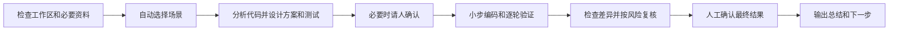

# 闻荫开发标准流程：一页操作卡

开发人员不需要记场景编号、流程步骤或固定提示词。打开源码工作区，指定 `winin-dev-sop` 和任务即可。

## 1. 开始任务

```text
使用 winin-dev-sop 完成任务 MES-1234。
任务内容：工单列表增加产线和计划日期组合筛选，原有筛选保持不变。
相关资料：任务单链接、原型或日志路径。
```

Codex 可写成“使用 `$winin-dev-sop`”；Cursor 和 Claude Code 可使用 `/winin-dev-sop`。不要发送密钥、凭据、未脱敏生产数据和无权使用的客户资料。

## 2. AI 将自动执行



AI 能从源码、配置和测试获得的信息应当自己查找。只有缺少会改变业务结果的资料时，才要求开发人员补充原型、截图、日志、DDL、接口样例或业务规则。

## 3. 开发人员主要确认两次

请用下面的原话回复；只说 `ok` / `好的` / `可以` 不算数。AI 必须先展示内容，你再确认。

1. 编码前确认（新增功能、现有功能修改、缺陷处理）：看完方案、范围和测试设计后，回复 **`确认方案`**。简单展示修改可以跳过这一步。
2. 完成前确认（所有任务）：看完目标、文件级差异、验收结果、测试、未执行项和剩余风险后，回复 **`确认结果`**。

如果开发中新增了公共对象、公共接口、数据库变化、MOM 核心状态变化或明显扩大范围，AI 必须暂停并增加一次范围确认；旧的 `确认方案` / `确认结果` 作废，需要重新回复。

## 4. 如何判断任务结束

| 状态 | 含义 | 下一步 |
| --- | --- | --- |
| `ready_for_review` | 代码、验证和人工确认齐全 | 提交测试或代码评审 |
| `blocked` | 缺少业务决定、必要资料、权限或环境 | 按 AI 给出的恢复条件处理 |
| `observing` | 偶发缺陷正在等待现场证据 | 收集证据，不能称为已经修复 |
| `cancelled` | 任务撤回或仅用于实验 | 结束本任务，不声称已经交付 |

“代码已经生成”“看起来正确”或“AI 已自查”都不表示完成。最终至少应看到：实际修改摘要（文件级差异）、验收标准逐项结果、测试命令与结果、未执行项、剩余风险和下一步动作，并且你已经回复 **`确认结果`**。

任务工作文件默认写在 `.ai-sop/tasks/`。可将 Skill 内 `assets/consumer.gitignore.example` 合并进业务仓库 `.gitignore`；需要保留某次任务记录时用 `git add -f`。

## 5. 三条纪律

1. 一个工作目录同时只处理一个任务，只允许一个代理写代码。
2. 不允许通过删除正确测试、降低正确断言、吞异常或跳过必要构建来制造通过结果。
3. 人工确认后若范围或关键方案发生变化，旧确认失效，必须重新确认。
